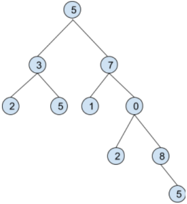

# Binary Tree

## The task

Create objects that can represent the following data structure (assume that node values are integers).

And an object that for any given object (node) will calculate, in a separate method/function,
the following values:
- The sum of values in a given subtree
- average value
- median

## The solution

- Since the binary tree shown in the diagram is not a binary search tree I had to figure out a way to insert elements into it. (In a BST, I simply insert a value and the tree logic inserts it on the appropriate branch/leaf). 
- I decided to assign an ID to each node. This way I can indicate to which node I want to add a child or which node should be the root of the subtree. This increased the time complexity because each time I have to search for this node in the array of all nodes.
- Calculating the sum and mean values in the subtree came easily using recrusion. The problem came when I wanted to count the median, because I needed to not only sum some value, but operate on all values to find the median. I decided for probably not the most optimal solution: to create a tree property with an array of subtree values. 